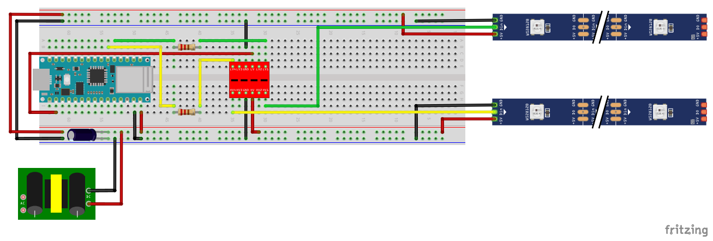

# WiFi_Controlled_Lightsaber
The objective of this project is to employ an Arduino microcontroller that can wirelessly control WS2812B LED strips over Wi-Fi. This allows users to remotely alter colors by issuing commands through a web page hosted by the Arduino. Additionally, this functionality is combined with a physical lightsaber hilt to provide an aesthetically pleasing decoration for any room.

## Table of Contents
- [Table of Contents](#table-of-contents)
- [Parts List](#parts-list)
    - [Electronics](#electronics)
    - [Lightsaber](#lightsaber)
    - [General Tools](#general-tools)
    - [Nice To Have](#nice-to-have)
- [Construction](#construction)
    - [Blade](#blade)
    - [Circuit](#circuit)
- [Program](#program)
- [Operation](#operation)
- [Room for Improvement](#room-for-improvement)
- [Resources](#resources)

## Parts List

#### Electronics
- 1x [Arduino Nano 33 IoT](https://store-usa.arduino.cc/products/arduino-nano-33-iot)
    - A microcontroller that has built in Wi-Fi capabilities. Can be purchased from other suppliers (DigiKey/Mouser/etc.) and cheaper Arduino clones are available.
- 2x [WS2812B Led Strip 1 Meter @ 144 leds/meter](https://www.btf-lighting.com/products/ws2812b-led-pixel-strip-30-60-74-96-100-144-pixels-leds-m?variant=25586938511460)
    - This is a well established brand that has great quality control and low prices.
- 1x [Power Supply 5v 30 Amp](https://www.amazon.com/dp/B0BNQ6Y88J?ref=ppx_yo2ov_dt_b_product_details&th=1)
    - This transformer will be used to supply the power and amps needed for both LED strips. This power supply will provide a large buffer on your power demands.
- 1x [Power Supply Outlet Adapter](https://www.amazon.com/dp/B07C9D6CXY?ref=ppx_yo2ov_dt_b_product_details&th=1)
    - The wire needed to connect your power supple to an outlet.
- 1x [Kasa Smart Plug](https://www.amazon.com/dp/B07RCNB2L3?psc=1&ref=ppx_yo2ov_dt_b_product_details)
    - This allows you to power the lightsaber on at the power source using your voice through Google Home or Alexa. Alternatively, you can use the native Kasa App.
- 1x [Logic Level Shifter Bi-Directional 3.3V-5V](https://www.amazon.com/dp/B07F7W91LC?psc=1&ref=ppx_yo2ov_dt_b_product_details)
    - This allows us to step up the 3.3v signal from the Arduino Nano to the expected 5v signal for the WS2812B Led Strips.
- 2x [220 ohm Resistor](https://www.google.com/search?q=220+ohm+resistor)
    - Needed to limit the current flowing out of each data pin through the circuit, prevents damaging the Arduino and LEDs. Many options available for purchase.
- 1x [100 uf Capacitor](https://www.arduino.cc/documents/datasheets/cap100uF.pdf)
    - This serves as a way to maintain a constant power supply. Many options available for purchase.

#### Lightsaber
- 1x [1" Thin Walled Pixel Blade Adapter](https://www.thecustomsabershop.com/1-Thin-Walled-Pixel-Blade-Adapter-P1346.aspx)
    - This is a small adapter that will attach to the bottom of the blade to hold the foam in place but also contains a hole to run wires through.
- 1x [1" Thin walled Trans White PolyC 40" long](https://www.thecustomsabershop.com/1-Thin-walled-Trans-White-PolyC-40-long-P529.aspx)
    - This tube will house the foam tubing that contains the LED strips.
- 1x [Foam tube for 1" thin tubes V2](https://www.thecustomsabershop.com/Foam-tube-for-1-thin-tubes-V2-P1336.aspx)
    - Your two LED strips that have been stuck together will slide into this foam tube and help diffuse the light.
- 1x [1" Thin walled Trans White parabolic Pixel blade tip](https://www.thecustomsabershop.com/1-Thin-walled-Trans-White-parabolic-Pixel-blade-tip-P1425.aspx)
    - This will be the tip of your blade and contains a hollowed out portion that you can slide the tip of your LED strip into so the whole tip will illuminate.
- 1x [3/4" x 2 ft PVC](https://www.google.com/search?q=pvc+pipe)
    - Search a local hardware store for something 2ft or less, you don't need more than a few inches.
- 1x [Lightsaber Hilt](https://disneyland.disney.go.com/shops/disneyland/savis-workshop-handbuilt-lightsabers/)
    - I'm using a the hilt of a Lightsaber from Disneyland specifically *Savi's Workshop*. However you can make a hilt with some simple plumbing supplies from a hardware store. There are plenty of guides on the web just be sure you leave enough gap between your blade and hilt to run some wiring or find a way to run the wire out another opening of the hilt.

#### General Tools
- 1x [WAGO Connectors 12 or More](https://www.amazon.com/dp/B0BKR2SR7H?psc=1&ref=ppx_yo2ov_dt_b_product_details)
    - Connectors for either testing a set up or can be a permanent solution 
- 1x [2 Pin Terminal Block Connector](https://www.amazon.com/dp/B088LSS14J?psc=1&ref=ppx_yo2ov_dt_b_product_details)
    - This is a way to connect the 18 AWG power wire up to your Arduino PCB board. It needs to be angled to fit into the +/- channels on the PCB but works well. You also only need one so if you can get away from buying this pack go for it.
- 1x [22 Awg Stranded Silicone Wire 26 ft 6 Colors](https://www.amazon.com/dp/B07G2JWYDW?ref=ppx_yo2ov_dt_b_product_details&th=1)
    - This is used for running the main Arduino logic and the long data line to your LED strips.
- 1x [20 awg Stranded Silicone Wire 23 ft Black and Red](https://www.amazon.com/dp/B08F79YG8Q?psc=1&ref=ppx_yo2ov_dt_b_product_details)
    - I used this to run the 5V power lines on the Arduino board. This one is probably not necessary but I like to keep a factor of safety when running power from a large transformer.
- 1x [18 awg Stranded Silicone Wire 30 ft Black and Red](https://www.amazon.com/dp/B07FMRDP87?ref=ppx_yo2ov_dt_b_product_details&th=1)
    - This is for running power to your LED strips and Arduino. It is probably a bit overkill but keeps the risk of overloading a wire low.
- 1x [Coarse ~60 Grit Sand Paper](https://www.homedepot.com/p/3M-Pro-Grade-Precision-9-in-x-11-in-60-Grit-Coarse-Faster-Sanding-Sheets-4-Pack-26060PGP-4/313353044)
    - Many of the mating surfaces are a tight fit and that can be fixed with some sanding.
- 1x [Hack Saw](https://www.homedepot.com/p/Stanley-6-in-Hack-Saw-STHT14037/311326599)
    - Needed to cut the main blade tube and the PVC pipe that will be used as a spacer.
- 1x [PCB Board](https://www.amazon.com/gp/product/B07ZYNWJ1S/ref=ppx_yo_dt_b_search_asin_title?ie=UTF8&th=1)
    - You only need one for this project and the quality of this PCB is perfect for what you will need. Feel free to find another variety.
- 1x [Solder Iron](https://www.amazon.com/gp/product/B06XFT1TPJ/ref=ppx_yo_dt_b_search_asin_title?ie=UTF8&psc=1)
    - This is a very cheap soldering iron that has everything you need for a project like this. Feel free to find another variety.
- 1x [Wire Stripper](https://www.amazon.com/gp/product/B000JNNWQ2/ref=ppx_yo_dt_b_search_asin_title?ie=UTF8&psc=1)
    - A decent wire stripper will be essential, just make sure it can cut the 22,20 and 18 awg wire needed for this project.

#### Nice To Have
- 1x [Dremel Tool Kit](https://www.homedepot.com/p/Dremel-3000-Series-1-2-Amp-Variable-Speed-Corded-Rotary-Tool-Kit-with-25-Accessories-and-Carrying-Case-3000-1-25H/203040434)
    - This will make your sanding much easier and give you the ability to cut a piece out of your spacer for wire strain relief.
- 1x [Glue Gun](https://www.amazon.com/Mr-Stick-Crafts-Craft-Sticks/dp/B08BCCS1SN/ref=sr_1_10?c=ts&keywords=Craft+Glue+Guns&qid=1684882690&s=arts-crafts&sr=1-10&ts_id=12898851)
    - Can be used to help hold the two LED strips together before being inserted into the foam tubing.
- 1x [Light Saber Wall Mount Upper Hilt and Blade Support](https://www.amazon.com/dp/B07DLXKMJX?psc=1&ref=ppx_yo2ov_dt_b_product_details)
    - I made two lightsabers and displayed them crossed this was one of the set of mounts needed.
- 1x [Light Saber Wall Mount Base Support](https://www.amazon.com/dp/B0B7D3ST7C?psc=1&ref=ppx_yo2ov_dt_b_product_details)
    - I made two lightsabers and displayed them crossed this was one of the set of mounts needed.

 

## Construction

### Blade

 

### Circuit

 

  
  <em>Circuit used to Control Lightsaber</em>

The circuit is showing two data lines from Pins 2 and 3 which both require a 220 ohm resistor. The data line leaving the Arduino Nano 33 IoT has a voltage of ~ 3.3v and needs to be stepped up to 5v for the WS2812B LED Strip. This is where the bidirectional Logic Level Shifter comes into play. We can pass the data line through the LVx channel and out of the corresponding HVx channel (ie. LV1 -> HV1). To do this the shifter needs reference voltages and the shared ground. The Pin marked just LV will be our 3.3v reference which is fed through the 3.3v power pin on the Arduino. Then from the power supply we can use the 5v as a reference by feeding it into the HV Pin. It is important to use the same ground for all components.

All this being said, please note that it is ok to power the Arduino Nano 33 IoT with a 5v power supply because this Arduino makes use of an onboard voltage regulator to adjust the power to the 3.3v needed for the board. Also not shown here is the use of the 2 pin terminal block. This is need to easily connect the 18 awg wire to the circuit board. **The 2 pin terminal block will need to be angled on the positive and negative strips of the board you are soldering to**. This is a minor issue and should give you no complications other than being moderately unpleasing to look at.

The importance of having the data line be separate for each LED strip is so that we can preserve a strong signal. If we split a single signal, when the LEDs heat up we will end up with intermittent signal integrity on the LED strips. This will yield unintended results.

You should be able to use your Wago Connectors here to connect the power and data line at the Arduino to your power and data lines that will run to the blade of the Lightsaber. Then on the other end of these data and power lines use the Wago connectors to connect to the corresponding JST connector that came with your LED strips. This will leave you with the ability to easily disconnect your components if the need arises.

You will obviously have to think about the wire length you need for your implementation. However, keep in mind your data lines should be kept close to 3 meters or less so you don't suffer weakening the integrity of your signal. 

<ins>**18 Awg:**</ins>
    - Used to run power to the LED strips and the Arduino

<ins>**20 Awg:**</ins>
    - Used to run power across the PCB Board to other components
    
<ins>**22 Awg:**</ins>
    - Used to run the data lines across the PCB to other components and to the LED Strips

 

## Program
-

 

## Operation
-

 

## Room for Improvement

**Improvement:**

- Thing 1

**To Do:**

- Thing 1

 

## Resources
-

 