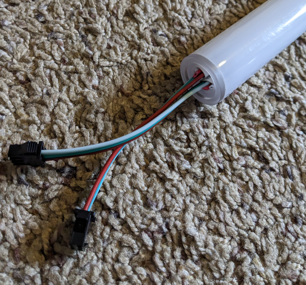
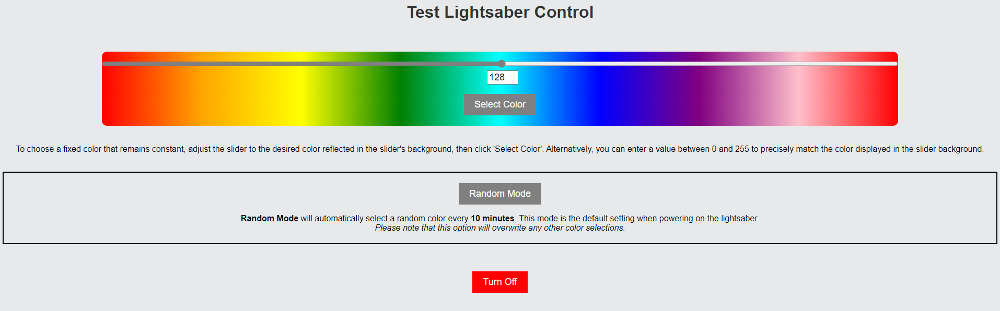

# WiFi_Controlled_Lightsaber
The objective of this project is to employ an Arduino microcontroller that can wirelessly control WS2812B LED strips over Wi-Fi. This allows users to remotely alter colors by issuing commands through a web page hosted by the Arduino. Additionally, this functionality is combined with a physical lightsaber hilt to provide an aesthetically pleasing decoration for any room.

## Table of Contents
- [Table of Contents](#table-of-contents)
- [Parts List](#parts-list)
    - [Electronics](#electronics)
    - [Lightsaber](#lightsaber)
    - [General Tools](#general-tools)
    - [Nice To Have](#nice-to-have)
- [Construction](#construction)
    - [Blade](#blade)
    - [Circuit](#circuit)
- [Program](#program)
- [Operation](#operation)
- [Room for Improvement](#room-for-improvement)
- [Open Source](#open-source)

## Parts List

#### Electronics
- 1x [Arduino Nano 33 IoT](https://store-usa.arduino.cc/products/arduino-nano-33-iot)
    - A microcontroller that has built in Wi-Fi capabilities. Can be purchased from other suppliers (DigiKey/Mouser/etc.) and cheaper Arduino clones are available.
- 2x [WS2812B Led Strip 1 Meter @ 144 leds/meter](https://www.btf-lighting.com/products/ws2812b-led-pixel-strip-30-60-74-96-100-144-pixels-leds-m?variant=25586938511460)
    - This is a well established brand that has great quality control and low prices.
- 1x [Power Supply 5v 30 Amp](https://www.amazon.com/dp/B0BNQ6Y88J?ref=ppx_yo2ov_dt_b_product_details&th=1)
    - This transformer will be used to supply the power and amps needed for both LED strips. This power supply will provide a large buffer on your power demands.
- 1x [Power Supply Outlet Adapter](https://www.amazon.com/dp/B07C9D6CXY?ref=ppx_yo2ov_dt_b_product_details&th=1)
    - The wire needed to connect your power supple to an outlet.
- 1x [Logic Level Shifter Bi-Directional 3.3V-5V](https://www.amazon.com/dp/B07F7W91LC?psc=1&ref=ppx_yo2ov_dt_b_product_details)
    - This allows us to step up the 3.3v signal from the Arduino Nano to the expected 5v signal for the WS2812B Led Strips.
- 2x [220 ohm Resistor](https://www.google.com/search?q=220+ohm+resistor)
    - Needed to limit the current flowing out of each data pin through the circuit, prevents damaging the Arduino and LEDs. Many options available for purchase.
- 1x [>=100 uf 25v Capacitor](https://www.arduino.cc/documents/datasheets/cap100uF.pdf)
    - This serves as a way to maintain a constant power supply. Many options available for purchase.

#### Lightsaber
- 1x [1" Thin Walled Pixel Blade Adapter](https://www.thecustomsabershop.com/1-Thin-Walled-Pixel-Blade-Adapter-P1346.aspx)
    - This is a small adapter that will attach to the bottom of the blade to hold the foam in place but also contains a hole to run wires through.
- 1x [1" Thin walled Trans White PolyC 40" long](https://www.thecustomsabershop.com/1-Thin-walled-Trans-White-PolyC-40-long-P529.aspx)
    - This tube will house the foam tubing that contains the LED strips.
- 1x [Foam tube for 1" thin tubes V2](https://www.thecustomsabershop.com/Foam-tube-for-1-thin-tubes-V2-P1336.aspx)
    - Your two LED strips that have been stuck together will slide into this foam tube and help diffuse the light.
- 1x [1" Thin walled Trans White parabolic Pixel blade tip](https://www.thecustomsabershop.com/1-Thin-walled-Trans-White-parabolic-Pixel-blade-tip-P1425.aspx)
    - This will be the tip of your blade and contains a hollowed out portion that you can slide the tip of your LED strip into so the whole tip will illuminate.
- 1x [3/4" x 2 ft PVC](https://www.google.com/search?q=pvc+pipe)
    - Search a local hardware store for something 2ft or less, you don't need more than a few inches.
- 1x [Lightsaber Hilt](https://disneyland.disney.go.com/shops/disneyland/savis-workshop-handbuilt-lightsabers/)
    - I'm using a the hilt of a Lightsaber from Disneyland specifically *Savi's Workshop*. However you can make a hilt with some simple plumbing supplies from a hardware store. There are plenty of guides on the web just be sure you leave enough gap between your blade and hilt to run some wiring or find a way to run the wire out another opening of the hilt.

#### General Tools
- 1x [WAGO Connectors 12 or More](https://www.amazon.com/dp/B0BKR2SR7H?psc=1&ref=ppx_yo2ov_dt_b_product_details)
    - Connectors for either testing a set up or can be a permanent solution 
- 1x [2 Pin Terminal Block Connector](https://www.amazon.com/dp/B088LSS14J?psc=1&ref=ppx_yo2ov_dt_b_product_details)
    - This is a way to connect the 18 AWG power wire up to your Arduino PCB board. It needs to be angled to fit into the +/- channels on the PCB but works well. You also only need one so if you can get away from buying this pack go for it.
- 1x [22 Awg Stranded Silicone Wire 26 ft 6 Colors](https://www.amazon.com/dp/B07G2JWYDW?ref=ppx_yo2ov_dt_b_product_details&th=1)
    - This is used for running the main Arduino logic and the long data line to your LED strips.
- 1x [20 awg Stranded Silicone Wire 23 ft Black and Red](https://www.amazon.com/dp/B08F79YG8Q?psc=1&ref=ppx_yo2ov_dt_b_product_details)
    - I used this to run the 5V power lines on the Arduino board. This one is probably not necessary but I like to keep a factor of safety when running power from a large transformer.
- 1x [18 awg Stranded Silicone Wire 30 ft Black and Red](https://www.amazon.com/dp/B07FMRDP87?ref=ppx_yo2ov_dt_b_product_details&th=1)
    - This is for running power to your LED strips and Arduino. It is probably a bit overkill but keeps the risk of overloading a wire low.
- 1x [Coarse ~60 Grit Sand Paper](https://www.homedepot.com/p/3M-Pro-Grade-Precision-9-in-x-11-in-60-Grit-Coarse-Faster-Sanding-Sheets-4-Pack-26060PGP-4/313353044)
    - Many of the mating surfaces are a tight fit and that can be fixed with some sanding.
- 1x [Hack Saw](https://www.homedepot.com/p/Stanley-6-in-Hack-Saw-STHT14037/311326599)
    - Needed to cut the main blade tube and the PVC pipe that will be used as a spacer.
- 1x [PCB Board](https://www.amazon.com/gp/product/B07ZYNWJ1S/ref=ppx_yo_dt_b_search_asin_title?ie=UTF8&th=1)
    - You only need one for this project and the quality of this PCB is perfect for what you will need. Feel free to find another variety.
- 1x [Solder Iron](https://www.amazon.com/gp/product/B06XFT1TPJ/ref=ppx_yo_dt_b_search_asin_title?ie=UTF8&psc=1)
    - This is a very cheap soldering iron that has everything you need for a project like this. Feel free to find another variety.
- 1x [Wire Stripper](https://www.amazon.com/gp/product/B000JNNWQ2/ref=ppx_yo_dt_b_search_asin_title?ie=UTF8&psc=1)
    - A decent wire stripper will be essential, just make sure it can cut the 22,20 and 18 awg wire needed for this project.
- 1x [Light Saber Wall Mount Base Support](https://www.google.com/search?q=light+saber+display)
    - Many options available I heavily modified the one I used with a Dremel tool. **The mount you use is important because this lightsaber is constructed in a way that the blade only *rests* (doesn't "snap" together) in the hilt so it can easily be dismantled.** You will want a mount that has 3 points of contact with your lightsaber. Two of those points should be on the hilt, one on the top portion and one on the bottom portion. The blade is light so a single support will work for that. Just be sure to properly support the hilt.

#### Nice To Have
- 1x [Dremel Tool Kit](https://www.homedepot.com/p/Dremel-3000-Series-1-2-Amp-Variable-Speed-Corded-Rotary-Tool-Kit-with-25-Accessories-and-Carrying-Case-3000-1-25H/203040434)
    - This will make your sanding much easier and give you the ability to cut a piece out of your spacer for wire strain relief.
- 1x [Glue Gun](https://www.amazon.com/Mr-Stick-Crafts-Craft-Sticks/dp/B08BCCS1SN/ref=sr_1_10?c=ts&keywords=Craft+Glue+Guns&qid=1684882690&s=arts-crafts&sr=1-10&ts_id=12898851)
    - Can be used to help hold the two LED strips together before being inserted into the foam tubing.
- 1x [Kasa Smart Plug](https://www.amazon.com/dp/B07RCNB2L3?psc=1&ref=ppx_yo2ov_dt_b_product_details)
    - This allows you to power the lightsaber on at the power source using your voice through Google Home or Alexa. Alternatively, you can use the native Kasa App.
- 1x [Cord Covers](https://www.amazon.com/dp/B08MT3ZXSD?psc=1&ref=ppx_yo2ov_dt_b_product_details)
    - Hide your loose wires so the final product looks more appealing when mounted. To fully hide the wires I replaced some of the WAGO connectors with a solder connection and shrink tubing, attaching the JST connector that was removed from the tip end of the LED strips.

 

## Construction

### Circuit

 

  
  

    <em>Fig.1 - Circuit used to Control Lightsaber</em>
  

The circuit is showing two data lines from Pins 2 and 3 which both require a 220 ohm resistor. The data line leaving the Arduino Nano 33 IoT has a voltage of ~ 3.3v and needs to be stepped up to 5v for the WS2812B LED Strip. This is where the bidirectional Logic Level Shifter comes into play. We can pass the data line through the LVx channel and out of the corresponding HVx channel (ie. LV1 -> HV1). To do this the shifter needs reference voltages and the shared ground. The Pin marked just LV will be our 3.3v reference which is fed through the 3.3v power pin on the Arduino. Then from the power supply we can use the 5v as a reference by feeding it into the HV Pin. It is important to use the same ground for all components.

All this being said, please note that it is ok to power the Arduino Nano 33 IoT with a 5v power supply because this Arduino makes use of an onboard voltage regulator to adjust the power to the 3.3v needed for the board. This is where you want to add your capacitor across the positive and negative terminal as well to help maintain a steady flow of power. Also not shown here is the use of the 2 pin terminal block. This is need to easily connect the 18 awg wire to the circuit board. **The 2 pin terminal block will need to be angled on the positive and negative strips of the board you are soldering to**. This is a minor issue and should give you no complications other than being moderately unpleasing to look at.

The importance of having the data line be separate for each LED strip is so that we can preserve a strong signal. If we split a single signal, when the LEDs heat up we will end up with intermittent signal integrity on the LED strips. This will yield unintended results.

You should be able to use your WAGO Connectors here to connect the power and data line at the Arduino to your power and data lines that will run to the blade of the Lightsaber. Then on the other end of these data and power lines use the WAGO connectors to connect to the corresponding JST connector that came with your LED strips. This will leave you with the ability to easily disconnect your components if the need arises.

You will obviously have to think about the wire length you need for your implementation. However, keep in mind your data lines should be kept close to 3 meters or less so you don't suffer weakening the integrity of your signal.

Finally, if you are using the Kasa plug don't forget to set it up so that you can remotely turn on and off the power to your Lightsaber. This plug works through both Google Home and Alexa and is pretty intuitive to set up.

<ins>**18 Awg:**</ins>
    - Used to run power to the LED strips and the Arduino

<ins>**20 Awg:**</ins>
    - Used to run power across the PCB Board to other components
    
<ins>**22 Awg:**</ins>
    - Used to run the data lines across the PCB to other components and to the LED Strips

 

### Blade

Building the blade probably requires the most manual labor out of the entire project. Before getting started you will want to test out these LED strips with the circuit you just built. There will be a JST connector on both ends and you need to remove one of them on each strip. I would also recommend cutting the power injection cables (The wires not in a JST connector) as short as possible so they are out of the way.

Then the first tedious task is to insert the LED strips into the foam tube. The LED strips should come with double sided tape and can be used to affix the LED strips together back to back. It just has to hold long enough to get the LEDs into the foam tube. You can cut the very corners of the LED you plan to put in the blade to make inserting them a little easier. There really is no magic formula to getting the LEDs into the foam tubing. It just takes time and patience and be sure to flatten the foam tube as you push the LED strips along to help get them through.

  
  

    <em>Fig.2 - Shows the blade tip and the naked LED that will sit inside of the cavity of the tip</em>
  

Now you will want to have a bit of the end of the LED strip to have an exposed LED that will fit in the tip. This is where you will need to do some sanding in two places. 
1. The mating surfaces of the blade and tip are too tight to press together. I suggest taking the sand paper or Dremel to the inner diameter of the blade. Careful not to overdo it so that you have a nice snug fit.
2. The second place is the inner diameter of the blade tip. There is not enough clearance to get the LED inside the tip. This is in my opinion the most annoying part of the project to do if you are not using a Dremel. But just work at it and get enough room that the exposed LED will easily slide in and out of the tip.

At this point you will want to assemble the blade tip in what will be your final configuration. Use this set up to make a mark where you will cut off the excess blade. The blade is translucent enough to see where everything is sitting inside and keep in mind the plug on the other end will sit slightly recessed around the press fit area. After you have your length marked, disassemble the blade so you can use the hack saw to cut off the excess blade. Be sure to sand down the edge and remove any sharp points.

  
  

    <em>Fig.3 - Used to hold the foam in place and allow the wires to be accessible</em>
  

At this point you will will have the same issue as before with the tip. The mating surfaces of the blade and outlet plug are too tight. So you will have to sand down the mating surface of the blade until you get a nice snug fit between the two components.

  
  

    <em>Fig.4 - Blade fully assembled</em>
  

Here you should be able to assemble the blade for the final time. Feed the JST connectors through the Outlet Plug and the blade is ready to use.

  
  

    <em>Fig.5 - Used to fill the bottom of the hilt's opening so that the needed wires can be reached when fully assembled</em>
  

Now that the blade is fully assembled we need to ensure that the blade doesn't bottom out in the hilt. To do this we will need a spacer made out of the PVC pipe. Your goal is to leave enough wire so that you can run the JST connector through the gap between the inner diameter of the Hilt and the outer diameter of the Blade but still have enough wire to work with with when interconnecting with the Arduino. You will need to balance this with enough of the blade remaining in the hilt as well as this point will act as a bit of a support for your final display.

Once you found that magic amount you can use the hacksaw again to cut your pvc piece to length. Then you will want to cut a bit of a notch to act as a strain relief for the wire to run through. If you are not using a Dremel you can cut a V shape which will serve the same purpose as the one pictured. Be sure to sand down all the edges so that there are no sharp corners.

  
  

    <em>Fig.6 - Show how all the parts fit together</em>
  

This exploded view should be enough to show you how the assembly will go together. You may want to use some tape so that the spacer stays orientated correctly in reference to the blade. Just don't go overboard with the tape.

  
  

    <em>Fig.7 - The wire is ran between the blade and inner diameter of the hilt cavity</em>
  

If at this point you feel the wire is too long or not long enough feel free to start with a new spacer. You should have a lot of left over PVC available to experiment with.

 

## Program

> It is important to note that this arduino can not connect to 5 GHz Wi-Fi frequency and will need a 2.4 GHz signal to operate.

The program has two files. The first file is **arduino_secrets.h**. This file is used to enter your network SSID and Password. The file is not tracked in the repository for what should be obvious reasons. It is an attempt to decouple your network name and password from the code it self.

The next file where the brunt of everything happens is the **arduino_controller.ino** file. This file makes use of 3 libraries.

1. **SPI.h:** Enables Serial Peripheral Interface (SPI) communication. This communication is used in the WiFiNINA library and is essentially a dependency even though it is not invoked directly in the code.
2. **WiFiNINA.h:** Provides WiFi functionality for connecting to networks and hosting the small server used to control the Arduino.
3. **FastLED.h:** Controls the WS2812B LED strips gives the capability to change colors and turning LED strips on/off.

The program uses the FastLED library to control the WS2812B LED strips. The LED strips are connected to the Arduino Nano 33 IoT board, with one strip connected to the DATA_PIN and the other strip connected to DATA_PIN_CLONE. The program supports a single lightsaber with two identical LED strips.

When powered on in the setup() section the program initializes the LED strips, sets the brightness and power limits, and starts the serial communication. However, the most critical component is setting the IP address of the Arduino, otherwise you won't know the IP of your Arduino.Even if you went through the trouble of figuring it out there is no guarantee your router will always assign the same IP. Once these steps are done, tt then attempts to connect to the configured WiFi network using the WiFiNINA module. Once connected, it starts a server on port 80 to host a small simple web interface accessible by placing the IP address you set into the URL of any browser on the same network.

The web interface allows users to control the lightsaber. When a client connects to the server, the program checks for incoming data. If there is data available, it reads the data and processes the commands. The program interprets the received commands and performs the corresponding actions to control the lightsaber's state and color. This is done through the use of simple GET requests that are submitted through a form from the client.

The web interface displays a selection of colors and an option to turn off the lightsaber and can be easily customized. When a user selects a color or the turn off option and submits the form, the program updates the LED strips accordingly with a simply power on/off animation.

 

## Operation

1. Connect the WS2812B LED strips to the DATA_PIN and DATA_PIN_CLONE pins defined in the code.
2. Adjust the LED strip setup values according to your specific configuration (number of LEDs, chip set, color order, brightness, maximum voltage, maximum amps, and IP Address).
3. Modify the arduino_secrets.h file to include your network's SSID and password for WiFi connection.
4. Upload the code to the Arduino Nano 33 IoT board.
5. Navigate to web interface by placing the IP address you set for the arduino in the URL location of a browser. Use the web interface to control your lightsabers from the dropdown menu like in Fig.8 below.

 

  
  

    <em>Fig.8 - Example of the web interface used to control the lightsabers</em>
  

 

 

  
  

    <em>Fig.9 - 2 lightsabers using this method mounted</em>
  

## Room for Improvement

**Improvement:**

- Use ESP32 instead of Arduino Nano, will yield many improvements, 
  - Faster processor
  - Dual core for multi threading
  - Cheaper
- Potentially add a pulsing effect, may be limited by the single core of the Arduino that does not allow for multithreading.

**To Do:**

- TODO Add randomized effects that will periodically cycle through hues
- TODO Add Holiday Based effects
- TODO Add a color pallette selector, instead of drop down

 

## Open Source

See LICENSE file in this repository for how to adhere to the specific open source requirements/conditions.

You are encouraged to modify and enhance the code and web interface according to your specific needs. Feel free to customize it, make improvements, and submit pull requests (PRs) if you would like to contribute your changes. This project is open source on GitHub and follows the requirements/conditions as listed in the LICENSE file, and your contributions are welcome as long as they follow the same LICENSE requirements/conditions. Enjoy controlling your lightsaber remotely!

 
